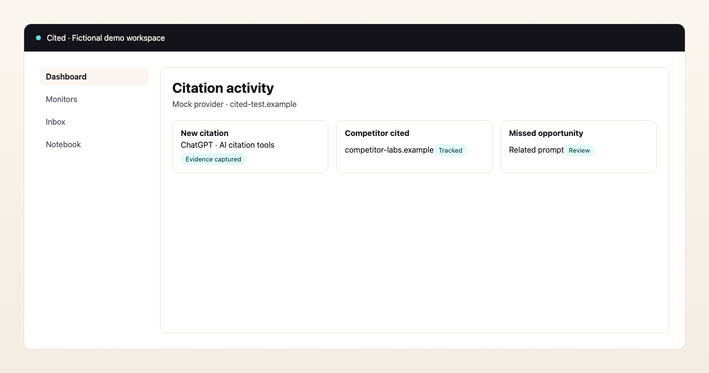
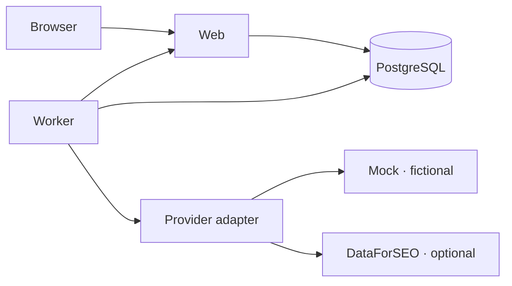

<p align="center">
  <a href="https://github.com/cited-cc/cited/actions/workflows/ci.yml"></a>
  <a href="https://github.com/cited-cc/cited/blob/main/LICENSE"></a>
  <a href="https://github.com/cited-cc/cited/releases"></a>
  <a href="https://cited.cc"></a>
</p>

<p align="center">
  
</p>

<h1 align="center">Cited</h1>

<p align="center">
  <strong>Cited is the open-source citation monitoring platform. Track when AI assistants mention, recommend, and cite your brand across the prompts that matter.</strong>
</p>

<p align="center">
  Cited monitors <strong>selected prompts and supported AI surfaces</strong> you configure. It does not monitor every AI answer everywhere. Surface availability depends on your selected provider.
</p>

<p align="center">
  
</p>

> **Project status:** Cited **v0.1.0** is the first public community release. Self-host with Docker Compose, or use [Cited Cloud](https://cited.cc) for managed hosting.

## Why Cited exists

Marketing teams need evidence when AI assistants cite, mention, or recommend their brand. Cited runs the prompts you care about, captures immutable response snapshots, and surfaces citations, competitor appearances, and missed opportunities in one workspace.

## Core capabilities

- **Citation monitoring** across configured prompts and supported surfaces
- **Competitor tracking** and missed-opportunity detection
- **Evidence ledger** with exports and notebook notes
- **Inbox** for review workflows
- **Self-hosted Docker** installation with secure secret generation
- **Mock provider** for offline demos with clearly labeled fictional data
- **DataForSEO adapter** with bring-your-own credentials for live monitoring

## How it works

1. Verify your domain and configure your brand
2. Add monitored prompts and choose AI surfaces
3. The worker schedules scan runs through your provider adapter
4. Cited classifies citations, mentions, recommendations, and competitor events
5. Evidence lands in the inbox and notebook; notifications fire when enabled

## Supported surfaces

| Surface | Mock provider | DataForSEO (BYO credentials) |
| --- | --- | --- |
| ChatGPT | Fictional demo data | Provider-dependent |
| Gemini | Fictional demo data | Provider-dependent |
| Perplexity | Fictional demo data | Provider-dependent |
| Claude | Fictional demo data | Provider-dependent |
| Google AI Overviews | Fictional demo data | Provider-dependent |
| Google AI Mode | Fictional demo data | Provider-dependent |

Mock mode uses **fictional data** labeled `[MOCK]`. DataForSEO requires **operator-supplied credentials**.

## Quickstart

**Prerequisites:** Docker Compose v2, Node.js 22+, 4 GB RAM recommended.

```bash
npm ci
npm run self-host:up
```

Then:

1. Retrieve the bootstrap token: `npm run self-host:token`
2. Open `/setup` and create the first owner
3. Sign in at `/sign-in`

Default URL: `http://localhost:3000`. Secrets are generated in `.cited/secrets/` and are never printed automatically. Stop without deleting data: `npm run self-host:down`. Diagnostics: `npm run self-host:doctor`.

Full guide: [docs/getting-started/quickstart.md](docs/getting-started/quickstart.md)

## First mock scan

Follow the [first monitor tutorial](docs/getting-started/first-monitor.md) to add fictional domains (`cited-test.example`), competitors (`competitor-labs.example`), prompts, and surfaces in mock mode. Optional demo fixtures: `npm run db:seed`.

## Real DataForSEO setup

1. Obtain DataForSEO API credentials
2. Configure provider and credentials in `.cited/config.env` per [DataForSEO guide](docs/providers/dataforseo.md)
3. Restart: `npm run self-host:down && npm run self-host:up`

## Architecture



Detailed reference: [docs/reference/architecture.md](docs/reference/architecture.md)

## Self-hosted vs Cited Cloud

| | Community edition | [Cited Cloud](https://cited.cc) |
| --- | --- | --- |
| Hosting | Self-hosted Docker | Managed |
| Auth | Local credentials | Managed service |
| DataForSEO | Bring your own | Managed infrastructure |
| Billing | Not required | Managed plans (may change) |

See [feature matrix](docs/reference/feature-matrix.md). Container images publish to `ghcr.io/cited-cc/cited` on release tags.

## Security and privacy

- Secrets in `.cited/secrets/` with restrictive permissions
- Mock mode makes no external provider calls
- Security reports: [SECURITY.md](SECURITY.md) (private disclosure)
- Operator guides: [docs/security/](docs/security/)

Cited is not claimed to be penetration-tested or certified for regulated compliance frameworks.

## Documentation

- [Documentation index](docs/README.md)
- [Quickstart](docs/getting-started/quickstart.md)
- [Configuration reference](docs/reference/environment-variables.md)
- [Commands](docs/reference/commands.md)
- [Public API](docs/reference/api.md)

## Quality checks

```bash
npm run lint && npm run typecheck && npm run test
npm run docs:check && npm run readme:check && npm run assets:check
npm run ci:check && npm run publication:check
```

## Contributing

Contributions require DCO signoff under **AGPL-3.0-only**. See [CONTRIBUTING.md](CONTRIBUTING.md) and [DCO.md](DCO.md).

## Roadmap

Directional milestones (not promises): [ROADMAP.md](ROADMAP.md)

## License and trademark

Source code: [AGPL-3.0-only](LICENSE). Trademarks: [TRADEMARKS.md](TRADEMARKS.md). This is not legal advice.

## Managed Cited

Prefer not to operate infrastructure? **[Cited Cloud](https://cited.cc)** is an optional managed service at cited.cc.
