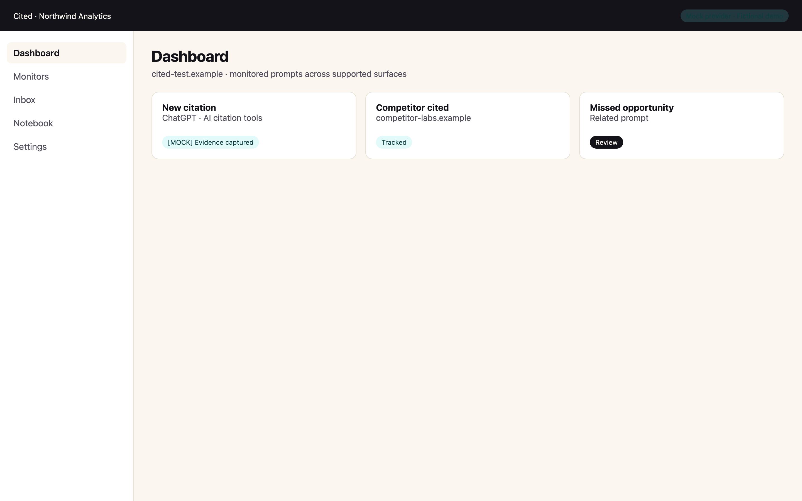

# Cited documentation

Documentation for the open-source Cited community edition. Cited monitors **configured prompts and supported AI surfaces**. It does not monitor every AI answer everywhere.

## Start here

| Guide | Description |
| --- | --- |
| [Quickstart](getting-started/quickstart.md) | One-command Docker self-hosting |
| [First run setup](getting-started/first-run-setup.md) | Bootstrap token, owner account, and `/setup` |
| [First monitor tutorial](getting-started/first-monitor.md) | Mock mode walkthrough with fictional data |
| [Configuration](getting-started/configuration.md) | Environment files and operational settings |
| [Manual installation](getting-started/manual-installation.md) | Local development without Docker |

## Concepts

| Topic | Description |
| --- | --- |
| [How Cited works](concepts/how-cited-works.md) | Monitoring model and evidence flow |
| [Prompts and surfaces](concepts/prompts-and-surfaces.md) | What you configure and what Cited can reach |
| [Citations and mentions](concepts/citations-and-mentions.md) | Event types and classification |
| [Competitors](concepts/competitors.md) | Competitor tracking and missed opportunities |
| [Evidence ledger](concepts/evidence-ledger.md) | Immutable response snapshots |
| [Monitoring lifecycle](concepts/monitoring-lifecycle.md) | Scheduling, scans, and worker processing |

## Providers

| Topic | Description |
| --- | --- |
| [Provider overview](providers/overview.md) | Mock vs DataForSEO |
| [Mock provider](providers/mock.md) | Fictional deterministic data |
| [DataForSEO](providers/dataforseo.md) | Bring-your-own credentials |
| [Building an adapter](providers/building-an-adapter.md) | Provider adapter boundaries |

## Operations

| Topic | Description |
| --- | --- |
| [Docker](operations/docker.md) | Compose stack and networking |
| [Worker](operations/worker.md) | Background jobs and scheduling |
| [Notifications](operations/notifications.md) | SMTP, Slack, and safe testing |
| [Backups](operations/backups.md) | Database backup workflow |
| [Upgrades](operations/upgrades.md) | Image rebuild and migration path |
| [Retention](operations/retention.md) | Data retention settings |
| [Troubleshooting](operations/troubleshooting.md) | Common self-hosted issues |

## Security

| Topic | Description |
| --- | --- |
| [Threat model](security/threat-model.md) | Assets, boundaries, and assumptions |
| [Hardening](security/hardening.md) | Production self-hosting guidance |
| [Privacy and data](security/privacy-and-data.md) | Data handling for operators |
| [Release checklist](security/release-checklist.md) | Pre-release verification |

## Reference

| Topic | Description |
| --- | --- |
| [Environment variables](reference/environment-variables.md) | Complete configuration reference |
| [Commands](reference/commands.md) | npm scripts by category |
| [Public API and routes](reference/api.md) | Health, auth, export, and internal worker endpoints |
| [Architecture](reference/architecture.md) | Self-hosted system diagram |
| [Feature matrix](reference/feature-matrix.md) | Community edition vs Cited Cloud |

## Maintainers

| Topic | Description |
| --- | --- |
| [Testing](maintainers/testing.md) | Test projects and fixtures |
| [CI](maintainers/ci.md) | GitHub Actions and local parity |
| [Branch protection](maintainers/branch-protection.md) | Phase 16 repository settings |
| [Action supply chain](maintainers/actions-supply-chain.md) | Pinned third-party actions |

## Publication boundary

Open-source publication remains blocked until Phase 16. See [open-source/publication-boundary.md](open-source/publication-boundary.md).

## Screenshots

Product UI examples (fictional mock data):

See [brand asset generation](assets/brand/README.md) for reproduction steps.

## Managed Cited

Prefer not to operate infrastructure? [Cited Cloud](https://cited.cc) is an optional managed service. Functionality and plans may change independently of this repository.
