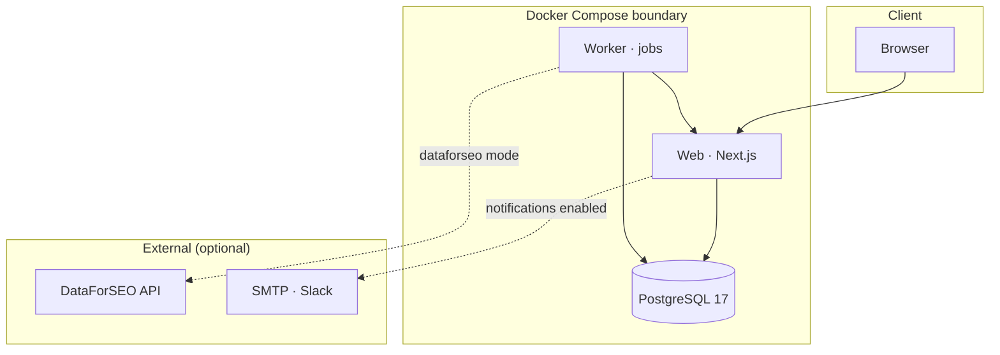

# Architecture (self-hosted)

Community edition architecture for Docker and manual installations.

## Overview



## Components

| Component | Role |
| --- | --- |
| **Web** | Next.js App Router UI, authenticated product shell, public marketing and docs |
| **Authentication** | Local email/password via NextAuth in self-hosted mode |
| **Application services** | Workspace, domain, monitor, inbox, notebook, export logic |
| **Database repositories** | PostgreSQL access layer with migration and runtime roles |
| **Monitoring engine** | Schedules scans, classifies responses, writes events |
| **Provider adapters** | `mock` (fictional) and `dataforseo` (live, BYO credentials) |
| **Evidence ledger** | Immutable AI response snapshots and citation evidence |
| **Worker** | Dispatches monitoring and notification jobs on a tick interval |
| **Notifications** | SMTP and Slack adapters (disabled by default) |

## Network boundaries

- Mock mode: no outbound provider calls
- DataForSEO mode: worker/web call official DataForSEO hosts only
- Secrets never leave `.cited/secrets/` except into container env at runtime

## Data flow

```text
Prompt + surface configuration
  → Worker dispatch
    → Provider adapter
      → AI response snapshot
        → Citation events + evidence
          → Inbox / notebook / notifications
```

## Related

- [How Cited works](../concepts/how-cited-works.md)
- [Docker operations](../operations/docker.md)
- [Monitoring lifecycle](../concepts/monitoring-lifecycle.md)
